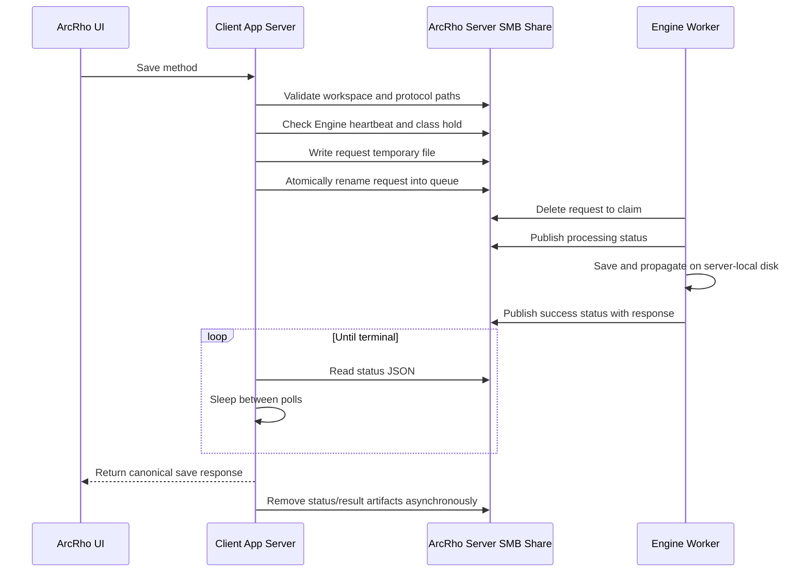
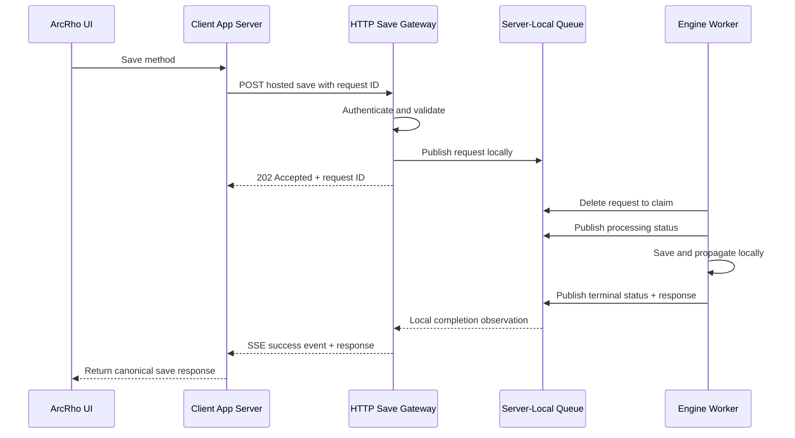

# Hosted Save Transport: Current SMB Protocol vs Proposed HTTP Gateway

Status: Dataset-sidecar and DFM-method pilot implemented; broader rollout remains proposed
Last updated: 2026-08-15

## Summary

ArcRho currently coordinates Engine-hosted saves through small JSON files on the ArcRho Server workspace. The design is correct, backward-compatible, and keeps calculation work beside the data, but a Client PC pays substantial SMB latency for every metadata check, write, rename, and status read.

The proposed design adds one authenticated HTTP Save Gateway on the ArcRho Server. Clients communicate only with that gateway; the gateway translates requests into the existing server-local hosted-save protocol and waits for Engine completion locally. This removes mapped-drive I/O from the client save path without changing canonical save functions, reserving-class leases, dependent propagation, or endpoint response shapes.

The HTTP gateway now carries every hosted save. SMB remains the rollback path
until the transport's TLS/authentication deployment is approved for broader
use.

## Implemented Transport

The transport covers every save kind in the canonical `SAVE_JOB_KINDS`
registry — dataset sidecars and DFM, Bornhuetter Ferguson, Cape Cod, bootstrap,
and result-selection methods — while keeping every save route and its `/plan`
sibling unchanged. The browser still calls its local app server; only the
app-server-to-Engine transport changes.

The supported kinds are derived from `SAVE_JOB_KINDS` rather than stored in the
Gateway configuration, so registering a new save procedure puts it on the HTTP
transport with no configuration change and no second list to update. A client
still asks `/api/capabilities` which kinds a Gateway serves and keeps any kind
an older deployed Gateway does not advertise on SMB, so a pending Gateway
upgrade degrades the transport instead of failing the save.

- `ArcRho Save Gateway` is a dedicated server executable supervised by every
  logged-in user's Orchestrator. One process wins the fixed port; another
  logged-in session restores it after its heartbeat becomes stale.
- The client sends the existing `ArcRhoHostedSave` payload. The Gateway writes
  the same Engine request locally and observes completion locally.
- A receipt is persisted before Engine publication and binds the request ID to
  the canonical request SHA-256. Same-ID replay returns the stored outcome;
  different content under the same ID returns `409`.
- The no-IT pilot uses an HMAC credential per user and plain HTTP on the
  controlled internal network. HMAC prevents credential disclosure and
  payload tampering, but plain HTTP does **not** encrypt dataset or DFM content. This
  is a performance pilot only; production rollout still requires HTTPS.
- `%APPDATA%\ArcRho\hosted_save_gateway.json` is the local-user feature flag
  and credential. On ArcRho startup, a missing file triggers automatic
  enrollment when the shared Gateway configuration has a `client_url` and the
  endpoint is reachable. The same check runs after Server Connection changes.
  An existing file is authoritative, including `enabled: false`; invalid
  enabled configuration fails explicitly and never silently falls back.
- Initial server setup uses
  `py -3.10 data-engine/src/arcrho_save_gateway/configure_pilot.py --user <login> --url <gateway-url>`.
  The command records the canonical client URL, updates the server registry,
  and installs the current user's local credential without printing the
  secret. Other users are enrolled automatically by ArcRho and do not run the
  command.
- Automatic enrollment probes the Gateway before creating a local credential,
  serializes updates to the shared user registry, and leaves SMB as the default
  if the pre-enrollment check cannot complete. Once the local HTTP credential
  exists, uncertain HTTP submissions still never fall back to SMB.
- The Orchestrator is the only starter. Every signed-in account's Orchestrator
  restores the Gateway from `apps.save_gateway.auto_create_instance`, so no
  login registration is needed; `configure_pilot.py` removes the pilot-era HKCU
  Run entry when it provisions a user. The first process to bind owns the
  machine-wide listener and later copies exit, which requires the Gateway to
  refuse address reuse — Python's `HTTPServer` default would otherwise let a
  second process bind the same port on Windows and serve part of the traffic.
- Client latency records identify `transport` as `smb` or `http_gateway` for
  like-for-like comparison in `client_save_latency.jsonl`.

## Goals

- Remove Client PC SMB operations from Engine-hosted saves.
- Preserve the current save endpoints and response payloads.
- Preserve Engine worker scaling, delete-to-claim behavior, reserving-class leases, and inline dependent propagation.
- Make retries idempotent so an uncertain network response cannot execute a save twice.
- Support mixed client versions during rollout.
- Keep project paths server-owned and location-independent.

## Non-Goals

- Rewriting DFM or other method calculations.
- Moving canonical save logic into the gateway.
- Allowing clients to address individual Engine worker instances.
- Replacing the existing dependent-propagation algorithm.
- Making interactive hosted saves durable business workflows with automatic retry.

## Current Design: SMB File Transport

The Client PC app server and ArcRho Engine communicate through the shared ArcRho Server workspace.



### Current Protocol

1. The client runs the live-Engine and reserving-class preflight.
2. The validated workspace root is reused by the request publisher.
3. The request file itself represents queued state; no separate queued-status file is written.
4. The client writes a temporary request and atomically renames it into the requests root.
5. An Engine worker claims the request by deleting it.
6. The Engine publishes `processing`, runs the canonical save under the reserving-class lease, performs dependent propagation inline, and publishes a terminal status.
7. A current Engine embeds the complete response in the terminal success status. It also writes the legacy result file for older clients.
8. The client waits 0.5 seconds before its first status read, then polls until terminal.
9. Terminal artifacts are removed asynchronously.

Successful protocol-path validation is cached for 30 seconds. Engine heartbeat and reserving-class hold checks still run for every save.

### Measured Client Latency

Measurements from project `NJ_Annual_Prod_202605_Fake`, reserving class `PRNJ - PA\PA\All States\Direct Group\COL`:

| Observation | Total | Preflight | Request publish | Remote polling | Status reads |
| --- | ---: | ---: | ---: | ---: | ---: |
| Original C22 SMB protocol | 4,686 ms | 579 ms | 644 ms | 1,988 ms | 1,273 ms / 3 reads |
| Optimized C22, cold path cache | 2,875 ms | 588 ms | 654 ms | 1,631 ms | 766 ms / 2 reads |
| Optimized C12, warm path cache | 2,458 ms | 197 ms | 644 ms | 1,585 ms | 708 ms / 2 reads |
| Slow C22 outlier | 5,015 ms | 229 ms | 1,550 ms | 3,235 ms | 1,648 ms / 4 reads |

The local CPU work is negligible. The remaining client latency is primarily:

- approximately 600–1,550 ms to publish one request through SMB;
- approximately 350–490 ms for each status-file read;
- polling delay while waiting to observe Engine completion;
- approximately 200 ms of warm-cache preflight checks that still touch the share.

### Strengths

- No separately exposed application service is required.
- Shared-folder permissions provide an existing access boundary.
- Atomic rename and delete-to-claim are well understood and tested.
- Engine workers remain independent and horizontally scalable.
- A disconnected client does not run calculation code locally.

### Limitations

- Tiny filesystem operations pay full mapped-drive latency.
- SMB latency varies significantly across otherwise identical saves.
- Status polling adds both filesystem reads and detection delay.
- Client preflight still requires network-drive metadata operations.
- Filesystem errors cannot always distinguish temporary network trouble from a missing status.
- Consistently reaching sub-two-second saves is unlikely while the client remains on the SMB protocol.

## Proposed Design: HTTP Save Gateway

Deploy one Save Gateway service on the ArcRho Server and supervise it centrally. Clients connect to the gateway, never to an individual Engine worker.

The lowest-risk first version keeps the existing request/status files internally. The gateway writes and reads those files on server-local disk, where the operations are fast. Engine workers continue using the current hosted-save contract unchanged.



### Component Responsibilities

#### Client App Server

- Build the existing logical hosted-save request.
- Generate and retain a stable request ID before submission.
- Send the request to the configured gateway URL.
- Reconnect or query by the same request ID after an uncertain response.
- Return the gateway's terminal response through the existing ArcRho save endpoint.
- Never traverse the ArcRho Server workspace during the hosted-save transport.

#### Save Gateway

- Authenticate the caller and derive or verify the requesting identity.
- Validate the allowlisted save kind, logical project name, reserving class, payload size, and request ID.
- Make request acceptance idempotent.
- Perform Engine availability and reserving-class preflight on the server.
- Publish the existing request contract into a server-local queue.
- Observe server-local status changes.
- Retain accepted/terminal request receipts for reconnect and replay.
- Stream progress and the terminal response to the client.
- Apply concurrency limits and backpressure.

#### Engine Worker

- Continue claiming exactly one request.
- Continue acquiring the reserving-class lease.
- Continue executing the canonical app-server save function.
- Continue running dependent propagation inline.
- Continue publishing the canonical terminal response.

The gateway must not contain calculation or method-specific save logic.

## Proposed HTTP Interface

Exact route names remain an implementation decision. A minimal interface would be:

### Submit

```http
POST /api/hosted-saves
Idempotency-Key: <request-id>
Content-Type: application/json
```

The body uses the existing logical `ArcRhoHostedSave` contract. It contains logical project/class names, not absolute paths.

```json
{
  "Function": "ArcRhoHostedSave",
  "ContractVersion": 1,
  "RequestId": "5fe7d2f69a924d47afea22434e58029f",
  "SaveKind": "dfm_method",
  "Mode": "commit",
  "ProjectName": "NJ_Annual_Prod_202605_Fake",
  "Path": "PRNJ - PA\\PA\\All States\\Direct Group\\COL",
  "Args": [],
  "Kwargs": {}
}
```

Response:

```http
202 Accepted
```

```json
{
  "request_id": "5fe7d2f69a924d47afea22434e58029f",
  "status": "accepted"
}
```

### Read Current State

```http
GET /api/hosted-saves/{request_id}
```

Returns `accepted`, `processing`, `success`, or `error`. A terminal response includes the canonical save response or error status/message.

### Stream Completion

```http
GET /api/hosted-saves/{request_id}/events
Accept: text/event-stream
```

Server-Sent Events are preferred over WebSockets because the flow is one-way, reconnect behavior is simple, and ordinary HTTP infrastructure can support it. If streaming is unavailable, short-interval HTTP GET polling is an acceptable fallback and remains much cheaper than SMB polling.

### Health and Capability

```http
GET /api/capabilities
```

The response tells clients whether hosted-save HTTP transport and event streaming are available. Capability discovery must not imply that retrying with a new request ID is safe.

## Idempotency and Failure Handling

Idempotency is mandatory. A client must never create a second save merely because the first HTTP response was lost.

| Situation | Required behavior |
| --- | --- |
| Initial POST clearly rejected before acceptance | Client may retry the same request ID. |
| POST connection fails with uncertain acceptance | Client queries or resubmits the same request ID. |
| Same request ID and same canonical request | Gateway returns the existing receipt/status/result. |
| Same request ID with different request content | Gateway rejects the conflict. |
| Client disconnects after acceptance | Work may continue; terminal state remains queryable for a bounded retention period. |
| Gateway restarts | Accepted and terminal receipts survive through server-local persistence. |
| Engine unavailable before acceptance | Gateway returns 503; nothing is queued. |
| Reserving class held | Gateway returns 423 or retains an explicitly defined accepted/queued state; the policy must match current UX. |
| Engine crashes after claim | Client receives the existing processing timeout behavior and keeps unsaved editor state. |

The gateway can initially persist receipts through the existing request/status files plus a small server-local receipt index. A later implementation may replace the internal files with SQLite or another queue, but that is not required to remove client SMB latency.

Automatic fallback from HTTP to SMB is unsafe after uncertain acceptance unless both transports share the same idempotency store. During rollout, fallback is allowed only when the capability check or connection failure proves the gateway could not have accepted the request. Otherwise the client must recover by the same request ID through HTTP.

## Security Model

The current share relies heavily on filesystem permissions. HTTP introduces an explicit service boundary and therefore requires explicit authentication and authorization.

Required controls:

- HTTPS for every client connection.
- Windows Integrated Authentication where deployment infrastructure supports it, or short-lived signed service credentials.
- Server-derived user identity; do not trust a JSON `UserName` without binding it to the authenticated principal.
- Firewall rules limited to approved ArcRho client networks.
- Existing save-kind allowlist enforcement.
- Logical project and reserving-class identifiers only; reject absolute paths and path traversal.
- Project/reserving-class authorization before request acceptance.
- Request and response size limits.
- Per-user and global concurrency limits.
- Audit records for acceptance, claim, terminal outcome, user, project, class, and request ID without logging method payloads.
- Certificate deployment and renewal owned by server operations, not individual clients.

## Current vs Proposed Comparison

| Area | Current SMB design | Proposed HTTP gateway |
| --- | --- | --- |
| Client transport | Atomic files and status polling over mapped/UNC drive | HTTPS request plus SSE or HTTP status query |
| Client workspace access during save | Required | Not required |
| Queue location | Shared workspace accessed by client and Engine | Server-local queue accessed by gateway and Engine |
| Queued state | Request file | Gateway receipt plus server-local request |
| Completion | Client reads terminal status file | Gateway returns/streams terminal response |
| Worker discovery | Filesystem watchdog | Unchanged internally in the first version |
| Claim semantics | Delete-to-claim | Unchanged internally in the first version |
| Reserving-class lease | Engine-owned | Engine-owned and unchanged |
| Canonical save logic | Engine imports app-server service | Unchanged |
| Client authentication | Windows session plus share access; identity travels in request | Explicit HTTPS authentication bound to request identity |
| Retry safety | Random request ID; limited reconnect semantics | Required idempotency receipt and same-ID recovery |
| Mixed versions | Current and legacy result files | HTTP capability rollout while SMB clients continue working |
| Typical measured latency | Approximately 2.5–2.9 s, with SMB outliers | Expected to approach Engine execution time plus normal HTTP latency |
| Main operational dependency | SMB availability and permissions | Gateway availability, TLS, authentication, and firewall configuration |
| Observability | Client JSONL plus Engine filesystem log | Structured gateway request metrics plus existing client/Engine diagnostics |

## Expected Performance

The gateway removes these measured Client PC costs from the critical path:

- approximately 640 ms of normal SMB request publication;
- approximately 700–770 ms for two normal SMB status reads;
- SMB polling detection delay;
- most or all client-side workspace/preflight SMB operations.

Engine execution time remains. Based on the observed saves, an HTTP design could plausibly reduce a typical 2.5–2.9 second save toward approximately one second, but this is a design target rather than a guarantee. Load testing must measure:

- request acceptance latency;
- queue-to-claim latency;
- Engine execution latency;
- terminal delivery latency;
- concurrent saves across different reserving classes;
- contention within one reserving class;
- gateway restart and reconnect behavior.

## Rollout Plan

1. Define the canonical HTTP request, receipt, status, error, and idempotency contracts.
2. Build a single Save Gateway supervised on the ArcRho Server.
3. Reuse the existing server-local hosted-save request/status protocol behind the gateway.
4. Add authentication, authorization, TLS, retention, rate limits, and structured metrics.
5. Add `/api/capabilities` and same-request-ID recovery.
6. Add an HTTP transport client behind a runtime feature flag.
7. Keep the SMB transport available for clients that have not upgraded.
8. Pilot with C22 and the existing local latency log, comparing end-to-end and Engine execution timings.
9. Expand to all hosted-save kinds after concurrency, failure, and lease tests pass.
10. Remove client SMB hosted-save transport only after the supported client fleet has upgraded and rollback criteria are satisfied.

## Acceptance Criteria

- Existing save routes retain their request/response shapes and HTTP status behavior.
- DFM, Result Selection, Bornhuetter Ferguson, Cape Cod, Bootstrap, and dataset sidecar saves all use one gateway contract.
- No current-client network-drive operation occurs between save submission and terminal response.
- The Engine remains the only executor of canonical hosted-save work.
- Reserving-class lease and dependent-propagation behavior remain unchanged.
- Replaying the same accepted request ID cannot execute the save twice.
- A conflicting payload under an existing request ID is rejected.
- Client reconnect after a dropped response returns the existing terminal outcome.
- Gateway restart does not lose accepted or terminal receipts within the retention window.
- Authentication identity matches the user recorded in sidecars and indexes.
- Gateway unavailability leaves unsaved work in the editor and cannot cause an ambiguous automatic SMB duplicate.
- Mixed old/new clients work during the rollout window.
- Performance tests demonstrate a material reduction from the current optimized SMB baseline.

## Open Decisions

- Whether the Save Gateway is a dedicated executable or a separately hosted service within the orchestrator process. A dedicated service provides the cleanest security and failure boundary.
- Whether Windows Integrated Authentication is available across every supported client/server topology.
- Certificate issuance, hostname, port, and renewal ownership.
- Server-Sent Events versus HTTP polling as the required baseline.
- Receipt persistence format and retention duration.
- Maximum accepted request/response sizes.
- Per-user, per-project, and global concurrency limits.
- Whether the gateway initially keeps the filesystem worker queue or introduces SQLite immediately. Keeping the current server-local files is the lower-risk first step.
- The exact rule for returning 423 before acceptance versus accepting and queueing behind a held reserving class.

## Recommendation

Implement the gateway as an additive transport layer first. Keep the existing Engine request/status protocol behind it, but move every interaction with that protocol onto the ArcRho Server. This captures the client-latency benefit with the smallest change to proven worker, lease, calculation, and propagation behavior.

Do not expose individual Engine worker ports, place canonical save logic in the gateway, or automatically switch to SMB after an uncertain HTTP submission.
