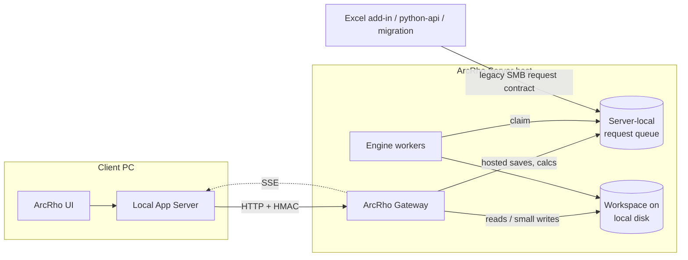

# Hosted Workspace Transport: Moving All Client PC Workspace I/O to the HTTP Gateway

Status: Decisions confirmed 2026-08-15; Phase 1 reads and Phase 2 engine calculations implemented
Last updated: 2026-08-16
Related: [hosted_save_http_transport.md](hosted_save_http_transport.md) (the save-only pilot this plan extends)

## Implemented So Far

Phase 1 reads landed as a generic transport rather than one hand-written
endpoint per read: `python-api/src/arcrho_workspace_read_contract.py` holds
the `WORKSPACE_READ_KINDS` registry (kind → `app_server.services` function and
its keyword arguments), the Gateway executes a registered kind in-process
against local disk (`POST /api/workspace-reads`, `server-components/src/arcrho_gateway/workspace_reads.py`,
now bundling `frontend/app_server` like the Engine), and the client routes
select the transport per request through
`frontend/app_server/services/workspace_read_client.py`, rebasing server paths
onto the client's workspace root and logging each read to
`client_read_latency.jsonl`. Registered today: the reserving-class index
(`GET /datasets/cached`, `GET /dfm/method-index`), the cached-dataset load
bundle, DFM/RS/BF/CC/bootstrap method loads, and the Project Settings
`GET /table_summary`. See
`frontend/docs/app_server/domains/workspace_reads.md` for the transport rules.

Phase 2 engine calculations landed 2026-08-16 as the same shape:
`python-api/src/arcrho_engine_calculation_contract.py` holds the
`ENGINE_CALCULATION_KINDS` registry (Engine function → exact request-file keys,
server-owned keys a client may never send, allowed output variants), the
Gateway serves `POST /api/engine-calculations`
(`server-components/src/arcrho_gateway/engine_calculations.py`) by running the
canonical `app_server` publish-and-wait exchange against the server-local
`requests` root — the request file and CSV are unchanged, so the Engine handler
is untouched and Excel/`arcrho_api`/migration keep publishing over SMB — and
every `arcrho_runtime_service` request site routes through
`frontend/app_server/services/engine_calculation_service.py`, which uses the
Gateway only when the output CSV is on a network drive and the function is
advertised, keeps the local exchange as the fallback before acceptance, never
publishes twice after acceptance, and logs each request to
`client_read_latency.jsonl` as `engine_calculation`. The same route also
carries `dataset_run` / `dataset_precheck` operations: the `/arcrho/tri*` and
`/arcrho/vec*` routes run the whole `run_arcrho_tri` / `arcrho_precheck`
service on the server host (cache validation, exchange, sidecar write,
dependent enqueue, index refresh) and the client registers the returned
dataset handle — profiling showed the exchange was ~3 s of a ~15 s
length-change run and the sidecar/dependent SMB work the rest. See
`frontend/docs/app_server/domains/engine_calculations.md`.

The DFM and Result Selection RPC bridges followed on 2026-08-19, through the
read and mutation registries rather than a route of their own: `compare` is a
hosted read and `sync` / `keep-local` / `cleanup` / `update-remote` are hosted
mutations, so the request file the ArcRho Bridge claims is written on the
server host where that folder is local disk and the wait for its answer is a
file-system event. `apply` deliberately stayed local; see
[hosted_rpc_bridge_transport.md](completed/hosted_rpc_bridge_transport.md).

The bounded-server foundation, SSE, and small writes remain as planned below.

## Completed: the rename

`ArcRho Save Gateway` became **`ArcRho Gateway`** once Phase 1 reads showed the
old name describing roughly a third of what the component did. The replacement
is a bare role noun, matching Engine, Bridge, Orchestrator, and Launcher, so
Phases 2 to 4 cannot make it stale the way naming it after hosted saves did.
`ArcRho Server API` was considered and rejected: it collides with
`python-api/src/arcrho_api`, an unrelated public client library.

No legacy name is accepted anywhere. What moved:

| Surface | Now |
| --- | --- |
| Role key, `COMPONENT_ALIASES` | `gateway` |
| Python package | `server-components/src/arcrho_gateway/` |
| Deployed app folder | `apps/ArcRho Gateway/` |
| Heartbeat folder | `runtime/instances/arcrho_gateway/` |
| Config namespace | `apps.gateway.*` |
| Server registry | `config/arcrho_gateway.json` |
| Client credential | `%APPDATA%\ArcRho\arcrho_gateway.json` |
| Receipt store | `runtime/arcrho_gateway/receipts/` |
| Gateway log | `runtime/logs/gateway.log` |

One string deliberately keeps the old spelling: `STARTUP_VALUE_NAME` in
`configure_pilot.py` is the literal `ArcRho Save Gateway` HKCU Run value the
pilot wrote on provisioned machines. It is a key to an entry that already
exists rather than a name the component answers to, and renaming it would
silently stop the cleanup from finding anything to delete.

## Summary

The hosted-save HTTP gateway removed the Client PC's SMB traffic from the
Engine-hosted save path and measured well for DFM. Every other interaction the
Client PC has with the ArcRho Server workspace — reserving-class listings,
cached-dataset and method loads, legacy `ArcRhoTri`/`ArcRhoVec`/`ArcRhoHeaders`
calculation requests, change-watch pollers, per-user preferences, audit-log
appends, and index rebuilds — still goes through the mapped/UNC drive from the
bundled app server.

This plan grows the **ArcRho Gateway** into the Client PC's single access point
to the workspace and moves those interactions onto it, endpoint by
endpoint, using the same additive pattern the save pilot used: the browser
keeps calling its local app server; only the app-server-to-workspace transport
changes; each path is capability-probed and keeps SMB as its rollback until
proven.

The ArcRho Engine does **not** go away. It remains the only executor of hosted
saves, dependent propagation, project duplication, and dataset generation. What
becomes obsolete is the *client side* of the file-exchange protocol and the
client's direct reads of project JSON. The Excel add-in and other legacy
file-protocol consumers keep working on SMB unchanged.

## Confirmed Decisions

| Decision | Choice | Rationale |
| --- | --- | --- |
| End state | Full HTTP client: the Client PC never touches the share for project data | Removes every per-file SMB round trip, not only the expensive ones; a single transport is easier to reason about, instrument, and secure |
| Sequencing | Straight to gateway endpoints; no separate SMB micro-fix phase | The affected SMB paths are being replaced; effort goes into the replacement. Measurement comes from the client latency log added alongside the first endpoints |
| Authentication / transport | Keep the pilot's per-user HMAC over plain HTTP for the current 5–6 user cohort | Adequate authentication and integrity for a small, hand-managed group on a controlled network with limited IT support. See [Authentication Posture](#authentication-posture) for the triggers that require change |
| Excel add-in and legacy consumers | Coexist on SMB indefinitely | The Engine keeps watching `requests\` for the legacy contract at negligible cost; migrating VBA is gated on the auth decision and on HTTP reads being proven first |
| Server shape | Grow the Gateway into a threaded general server API | One process, one port, existing Orchestrator supervision and kill switch; read handlers call the same `app_server` services on local disk; heavy mutations still go to Engine workers through the local queue |
| First endpoints | Reserving-class index and cached-dataset load bundle together, each behind its own capability probe | Fixes the two reported symptoms (PI class listing, DSV open) in the first phase |
| Change notifications | Server-Sent Events from the start | One stream per client replaces every per-window SMB stat poller and the Electron `fs.watch` over SMB |

## What the Client PC Does Over SMB Today

The pilot gateway's complete route table is `/api/health`, `/api/capabilities`,
and `POST /api/hosted-saves` (`server-components/src/arcrho_gateway/main.py`).
Everything below is direct filesystem I/O from the app server on the Client PC.

### Reserving-class contents (PI page, `GET /datasets/cached`)

- Warm path (`dataset_instance_index_service.get_index`): one `isdir`, one
  `index.json` read, three parallel `scandir`s for the folder signature. Cheap.
- Cold path (`rebuild_index` → `build_dataset_index_payload`): the **client**
  creates and locks `.index.json.lock` on the share, opens **every** sidecar and
  method JSON in the class at 32-way parallelism, and rewrites `index.json`.
  This is `O(files in class)` SMB opens and is the dominant "PI feels slow"
  case; it fires whenever anything in the class changed since the last index
  write.
- `POST /dfm/method-index/refresh` calls `rebuild_index` unconditionally, with
  no signature short-circuit.
- The path panel's picker fires `reserving_class_combinations`,
  `reserving_class_types` (which can **write** `reserving_class_types.json` and
  `settings.xlsx` back to the project folder on a GET), filter-spec and
  hidden-paths reads of the per-user `preferences.json`.
- Electron opens an `fs.watch` on the reserving-class data folder over SMB per
  open PI page and `stat`s `index.json` on each event.

### Opening a cached dataset (Dataset Viewer, `POST /dataset/cache/load`)

Roughly 10–14 network operations on a warm open:

- sidecar: uncached `exists` + `open` (two round trips; bypasses
  `file_read_cache`);
- CSV resolution: `exists` + `isfile` per candidate, with a full `listdir`
  fallback when the sidecar lacks `csv_file`;
- the CSV read;
- three parallel hydration reads (origin labels, development labels, dataset
  type formula). On a header-cache miss the labels are **not** a read: they are
  an `ArcRhoHeaders` engine request written to `requests\` and polled over SMB,
  and `wait_for_file` creates and deletes a probe file inside the project data
  folder on every poll tick;
- a final `os.stat` of the CSV.

### Method pages (DFM and siblings)

- Method JSON and sidecar are read in parallel when `output_dataset` is known,
  sequentially under a lock otherwise.
- Every recalc reads one sidecar plus one full CSV per precedent, serially.
- Legacy-v1 upgrade on load, and `_mark_review_needed`, write directly to the
  share outside a hosted save.

### Cross-cutting

- `config._find_existing_project_dir` is a real network `isdir` (or a full
  `scandir` of `projects\` on a case miss), unmemoized, called by roughly twenty
  path resolvers, several times per request.
- Per open window: a 5 s object-change poll (one to two stats); on the PI page a
  5 s propagation-hold poll (lock stat plus `scandir` of the queued-requests
  folder); 750 ms job polling while propagation runs.
- Per-user preferences writes cost five to six network operations each with a
  250 ms client debounce.
- `audit_log.json` is read-modify-written whole under a process-local lock only;
  cross-machine it is last-writer-wins.
- Legacy engine calculations (`ArcRhoTri`/`ArcRhoVec`/`ArcRhoHeaders`/
  `ArcRhoProjectSettings`) are the entire non-save Engine RPC and are 100 %
  file exchange over SMB with a 15 s poll budget.

## Target Architecture

### Responsibilities

**Local App Server (Client PC)** keeps every browser-facing route and its
response shape. For each migrated route it: probes `/api/capabilities` (cached),
takes the HTTP path when the capability is advertised, otherwise the existing
SMB path. It records `transport` in the client latency log. It never traverses
the workspace on a migrated path. Local-only concerns stay local: Excel COM
link reads, `%APPDATA%` preferences and credentials, `Documents\ArcRho`
macros/scripts, file dialogs.

**ArcRho Gateway** authenticates every request with the existing HMAC
contract, resolves the workspace root once per request on local disk, and
serves reads by calling the same `app_server` service functions the Engine
already bundles. It performs small writes (preferences, audit log, RC caches,
index rebuilds) itself under the existing lock and atomic-replace patterns.
It publishes hosted saves and legacy calculations into the same server-local
request queue and observes completion locally. It hosts one SSE stream per
client. It contains no calculation or method-specific save logic.

**Engine workers** are unchanged: delete-to-claim, reserving-class lease,
canonical `app_server` save, inline dependent propagation, legacy calculation
handlers, heartbeat.

**Orchestrator** continues to supervise the Gateway as the machine-wide
singleton it already supervises as `gateway`.

### Gateway changes required before reads

The pilot is a hand-rolled `BaseHTTPRequestHandler` sized for a synchronous
save. Carrying reads for the fleet requires, in this order:

1. A bounded threaded request server. The pilot already runs on
   `ThreadingHTTPServer` with daemon threads (one thread per connection); one
   process on one port stays sufficient for the current user count. What is
   missing is a cap on concurrent handlers (per user and global), a separate
   small pool for long-lived SSE connections so they do not consume the request
   cap, per-request timeouts, and request/response size limits. A
   single-threaded handler is not an option: one hosted-save commit (up to
   180 s), one open SSE stream, or one streamed CSV would block every other
   user.
2. Streaming response bodies for CSV payloads.
3. Conditional GET (`ETag`/`If-None-Match` from mtime + size, or the index
   `folder_signature`) so an unchanged payload costs one round trip and no body.
4. Request-scoped workspace path resolution so `_find_existing_project_dir`
   runs once per request, on local disk.
5. Structured request metrics (route, user, project, class, elapsed, bytes,
   outcome) without payload logging.
Item 6 of this list — renaming the component away from `ArcRho Save Gateway`,
which named it after the first workload it carried — is **done**. It is now
`ArcRho Gateway` (role `gateway`), a bare role noun like Engine, Bridge, and
Orchestrator, so growing its scope through the phases below cannot make the
name stale again. No legacy name is accepted anywhere; see
[Completed: the rename](#completed-the-rename).

## HTTP Interface

Route names are provisional. All bodies are JSON unless stated; all identifiers
are logical (project name, reserving-class path, dataset name); absolute paths
and traversal are rejected as in the pilot.

### Capability discovery

`GET /api/capabilities` — extends the pilot payload with the list of migrated
read/write kinds and whether SSE is available. Client fallback to SMB is
per-kind and only when the kind is not advertised or the connection failed
before acceptance.

### Phase 1: reads

- `GET /api/projects/{project}/classes/{path}/index` — returns the canonical
  reserving-class `index.json` payload. The server performs the folder
  signature check and any rebuild on local disk under the existing
  `.index.json.lock`. Supports `If-None-Match` keyed on `folder_signature`.
- `POST /api/projects/{project}/classes/{path}/datasets/{name}/load` — the
  cached-dataset bundle: sidecar, hydrated origin/development labels, dataset
  type formula, CSV mtime, and the CSV body (streamed, or a second `GET` for the
  bytes when the sidecar/labels are unchanged). One call replaces the current
  10–14 operations. Header-cache misses run the `ArcRhoHeaders` engine request
  server-side.
- `POST /api/projects/{project}/classes/{path}/methods/{kind}/{name}/load` —
  method JSON + sidecar + precedent snapshots (sidecar + CSV per precedent,
  parallel on local disk).
- `GET /api/projects` and `GET /api/projects/{project}/settings/{file}` for
  `projects\index.json`, `general_settings.json`, `dataset_types.json`,
  `field_mapping.json`, `table_summary.json`, `reserving_class_*` caches.

### Phase 2: engine calculations

- `POST /api/engine/calculations` — body is the existing logical
  `ArcRhoTri`/`ArcRhoVec`/`ArcRhoHeaders`/`ArcRhoProjectSettings` request
  **without** `DataPath`; the server owns the output path, publishes the request
  into the local queue, waits for the CSV locally, and returns it. Removes the
  client probe-file writes and the 15 s SMB poll loop. The Engine handler is
  unchanged; the same queue continues to accept legacy SMB requests from Excel,
  `arcrho_api`, and migration.

### Phase 3: notifications

- `GET /api/events` (`text/event-stream`) — one stream per client. Server-side
  watchers on local disk emit `object-changed` (sidecar/method mtime),
  `class-index-changed` (`folder_signature`), and `class-hold-changed`
  (propagation lease/queue) events keyed by project and class. The client
  subscribes/unsubscribes per open window through
  `POST /api/events/subscriptions`. Replaces the 5 s object-change poll, the 5 s
  PI busy poll, the Electron `fs.watch`, and the 750 ms job poll.

### Phase 4: small writes

- `PUT /api/projects/{project}/users/me/preferences` — server-side
  read-merge-write with the existing atomic replace; identity comes from the
  HMAC credential.
- `POST /api/projects/{project}/audit` — server-side append under a
  server-local lock, fixing the current cross-machine last-writer-wins.
- Reserving-class cache refreshes (`reserving_class_types.json`,
  `settings.xlsx`, combinations, values, path-tree caches) move server-side and
  stop being triggered by client GETs.
- Direct method/sidecar writes outside hosted saves (legacy-v1 upgrade,
  `_mark_review_needed`) become hosted-save kinds or server-side writes.

## Idempotency and Failure Handling

- Reads are naturally idempotent; a lost response is simply retried.
- Engine calculations reuse the pilot's `RequestId` + canonical-SHA-256 receipt
  model: same ID and same content returns the stored CSV, different content
  under the same ID returns `409`.
- Small writes carry a client-generated request ID and are last-writer-wins
  per file on the server, serialized under a per-target lock.
- No migrated path automatically falls back to SMB after an uncertain HTTP
  response. Fallback is allowed only when the capability is not advertised or
  the connection failed before the server could have acted.
- API unavailability degrades to today's SMB behavior for reads during the
  rollout window; after SMB fallback is removed it surfaces as an explicit
  "server unavailable" state, never a silent local retry loop.
- SSE reconnect uses `Last-Event-ID`; the client re-issues its subscriptions on
  reconnect and treats a gap as "refresh everything visible".

## Authentication Posture

Decision: keep the pilot's per-user HMAC-SHA256 credential over plain HTTP for
the current cohort of roughly five to six users.

What it provides: the secret never travels on the wire; requests cannot be
tampered with or replayed outside the ±300 s window; the payload `UserName` is
bound to the signing credential.

What it does not provide: confidentiality. Once reads migrate, every dataset,
method, and sidecar anyone opens crosses the LAN in cleartext, and the per-user
secret sits in plaintext under `%APPDATA%\ArcRho\`.

Triggers that require changing this posture, in likely order:

1. A data-classification change, or a security/audit review asking how ArcRho
   data moves between machines. Remedy: TLS on the API. Additive, no auth
   redesign; a self-signed certificate pinned in the client is acceptable if IT
   will not issue one.
2. The user population outgrows a hand-managed registry, or revocation and
   rotation are needed when people leave. Remedy: Windows Integrated
   authentication (Negotiate), tying access to the AD account lifecycle.
3. The Excel add-in migrates to HTTP. HMAC and byte-exact canonical JSON in VBA
   is the expensive part; Windows Integrated auth through `WinHttp` is nearly
   free. This is the strongest practical reason to eventually switch.
4. ArcRho runs on anything other than a trusted internal segment.

TLS is the first gate to lift before any of these triggers; Windows Integrated
auth is the target if and when Excel migrates.

## Excel Add-in and Legacy Consumers

Decision: coexist on SMB. The Engine keeps watching `requests\` for the legacy
`ArcRhoTri`/`ArcRhoVec`/`ArcRhoHeaders`/`ArcRhoProjectSettings` contract at
negligible cost.

Consumers of that contract today: the Excel add-in (`excel-addin/src_vba/Core.bas`,
pure VBA, no HTTP, identity from `Environ$("USERNAME")`, distributed from the
share itself), `python-api/src/arcrho_api` and the macros built on it, and
`python-api/migration/resq_migration/engine.py`.

Consequences for this plan:

- Phase 2 must keep the legacy request handler and its client-supplied
  `DataPath` behavior intact; the HTTP calculation endpoint is a second entry
  into the same queue, not a replacement.
- The Orchestrator's five-minute garbage collection of loose files in
  `requests\` remains as-is.
- Future Excel migration, if pursued, needs: Windows Integrated auth (or a
  localhost hop through the installed ArcRho app server), server-owned output
  paths, and one batch endpoint per refresh pass rather than one HTTP call per
  UDF. That work is out of scope here.

## Rollout Plan

1. **API foundation** — threaded server, limits, streaming, conditional GET,
   request-scoped path resolution, metrics, rename. Extend `/api/capabilities`.
   Add a client read-latency log beside `client_save_latency.jsonl` recording
   `transport` per migrated route.
2. **Phase 1 reads** — reserving-class index and cached-dataset bundle first,
   behind separate capabilities; then method load and project/settings reads.
   Compare transports from the read-latency log on `NJ_Annual_Prod_202605_Fake`.
3. **Phase 2 engine calculations** — done: `POST /api/engine-calculations`;
   the runtime service's request sites switch when the capability is
   advertised (see Implemented So Far).
4. **Phase 3 SSE** — event stream and subscriptions; remove client pollers and
   the Electron `fs.watch` when the capability is advertised.
5. **Phase 4 small writes** — preferences, audit, RC caches, out-of-band method
   writes.
6. **Remove SMB fallback** per kind once the fleet has upgraded and rollback
   criteria are met. At that point the client no longer needs the workspace
   mapped for project data; the Excel add-in and legacy consumers still do.

Each phase updates the frontend release fragment and, where the Engine or
gateway bundle changes, follows the deployment authorizations in `AGENTS.md`.

## Acceptance Criteria

- Existing app-server routes retain their request/response shapes.
- On a migrated route with the capability advertised, the client performs zero
  workspace filesystem operations between request and response.
- Reserving-class index rebuilds run only on the server; the client never
  takes `.index.json.lock`.
- A cached-dataset open is one HTTP round trip when nothing changed, and one
  bundle call plus a streamed CSV otherwise.
- Legacy SMB requests from Excel, `arcrho_api`, and migration keep working
  unchanged throughout.
- SSE delivers object/index/hold changes without any client-side workspace
  polling; reconnect does not lose the subscription set.
- Same-ID replay of a calculation request cannot execute it twice.
- Per-endpoint SMB fallback works during rollout and never triggers after an
  uncertain HTTP response.
- Server-side metrics and the client read-latency log allow like-for-like
  transport comparison.
- No calculation or method-specific save logic lives in the API process.

## Open Items

- Exact route naming and whether the CSV body ships inline in the bundle or as
  a second conditional `GET`.
- SSE subscription granularity (per class vs per object) and event retention
  for `Last-Event-ID`.
- Concurrency limits and payload size caps.
- Whether the API process should also own the header-cache CSV lifecycle that
  the client currently deletes when stale.
- Whether the `arcrho_hosted_save_http_contract` module should be split, now
  that it owns the Gateway's configuration, credential, and receipt envelope
  alongside the hosted-save endpoint. The component name no longer matches the
  module that defines its config file.

## Documentation Drift to Reconcile

[hosted_save_http_transport.md](hosted_save_http_transport.md) still describes
the gateway allowlist as `dataset_sidecar` and `dfm_method` and sketches a
`202 Accepted` + SSE submit flow. The implemented contract derives
`HTTP_SAVE_KINDS` from the full `SAVE_JOB_KINDS` registry and drops any stored
subset (`python-api/src/arcrho_hosted_save_http_contract.py`), and the
implemented gateway is synchronous. That document should be updated by the
hosted-save expansion work; this plan builds on the implemented behavior.
